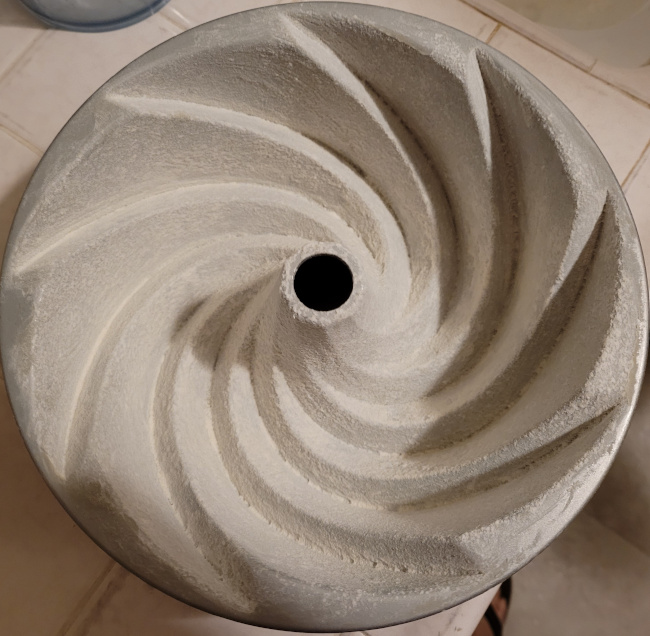
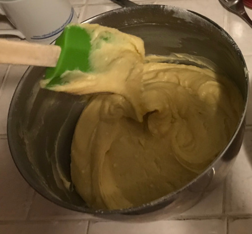
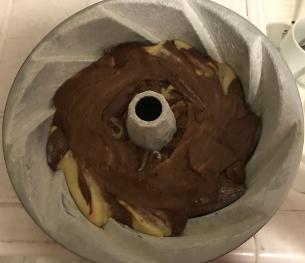
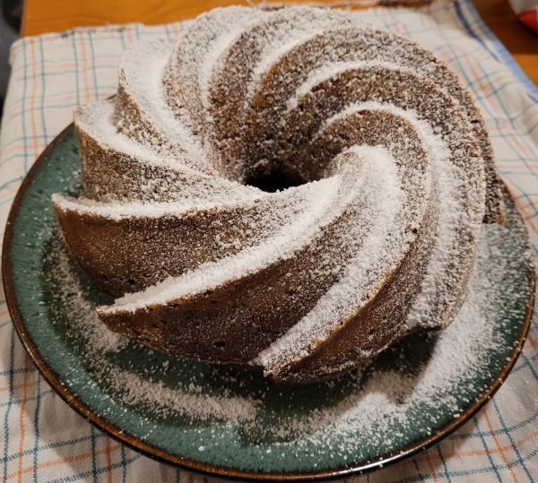
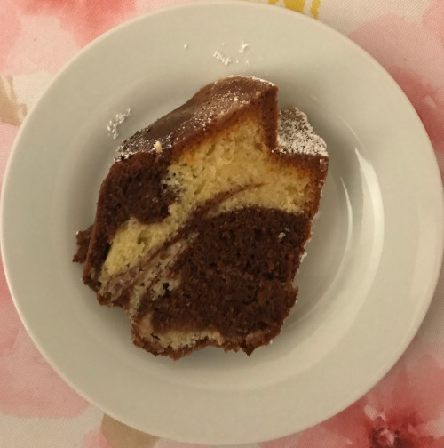

# Marmor Kuchen

This cake is German, although my mother was used to do it in Trieste.

## Ingredients

- 250 g  sweet butter
- 200 g  sugar
- bit of salt
- 5      eggs
- 300 g  flower
- 3 teaspoons backing powder
- 25  g  Cocoa
- 75  ml Milk

## Procedure

1. Prepare a cake pan by brushing melted butter on its walls and flouring them.

2. Work butter and sugar together until they become a cream.
3. Add one egg at the time and mix it in.
4. Add salt and flower, a bit at the time, and 50ml of milk to keep the batter fluid.

5. Pour 2/3 of the batter in the pan.
6. Add cocoa and 25ml of milk to the remaining 1/3 of the batter and mix throughly. Pour it in the pan. Then, with a fork, gently mix doing spirals from the bottom to the top to create a pattern of dark filaments in the final cake.

7. Bake at 175C for approximately 55 minutes.
8. Once out of the oven, wait for a few minutes, then take out of the pan and leave it on a rack for at least 2 hours.
9. Serve with powdered sugar.

